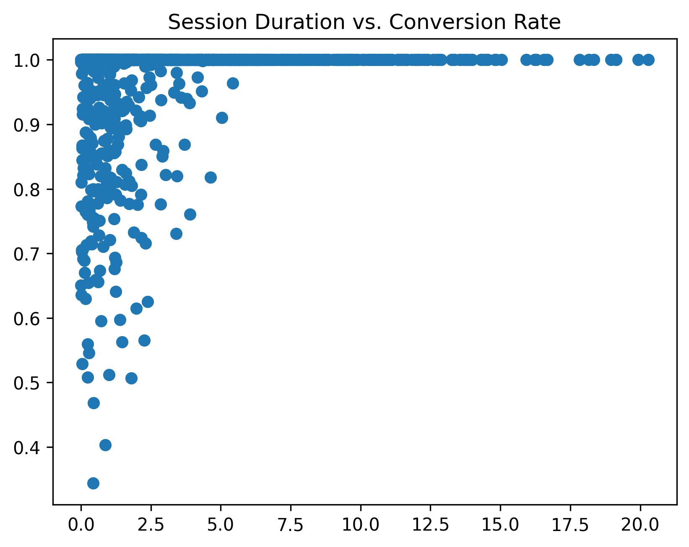
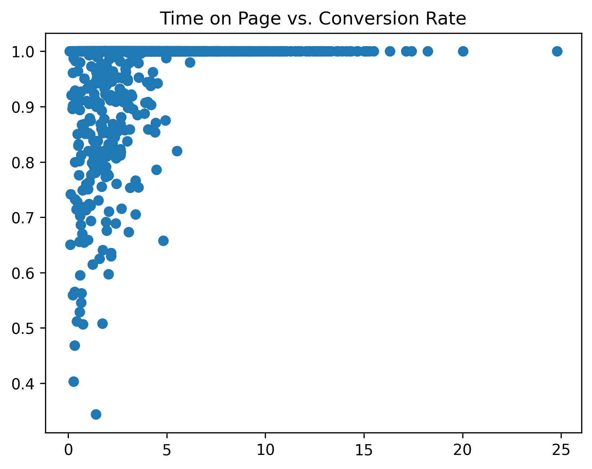
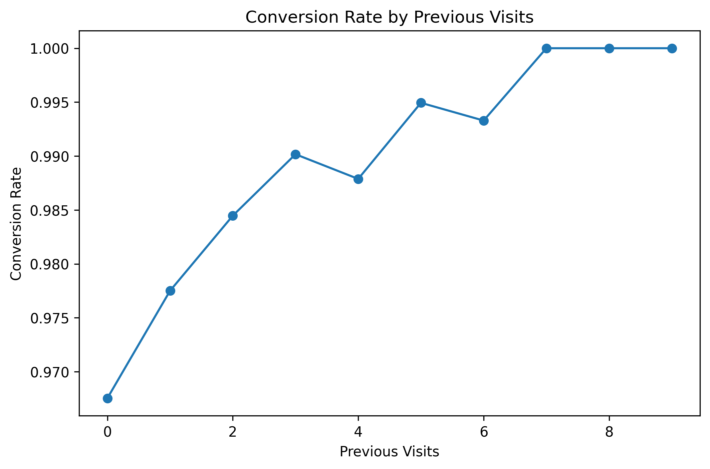

# **Análisis de Tráfico Web - Business Inteligence**

## **Introducción**
Este proyecto busca identificar los factores que impulsan la conversión de usuarios y sugiere estrategias de optimización. Denominamos conversión a concretar una acción deseada por el negocio, mientras que la tasa de conversión mide la efectividad de que el objetivo del sitio web se cumpla. 

El dataset provee la siguiente información:

- **Page Views**: La cantidad de páginas visitadas en una sesión.
- **Session Duration**: La duración en minutos de la sesión.
- **Bounce Rate**: La cantidad de usuarios que salieron del sitio web viendo una única página.
- **Traffic Source**: La fuente de origen del usuario.
- **Time on Page**: El tiempo que estuvo un usuario en una página específica.
- **Previous Visits**: La cantidad de visitas previas hechas por el mismo usuario.
- **Conversion Rate**: El porcentaje de usuarios que completaron una acción deseada.

---

## **Contenido**
1. [Análisis Exploratorio de Datos (EDA)](#Análisis-exploratorio-de-Datos-(EDA))
2. [Modelo Predictivo (Machine Learning)](#Modelo-Predictivo-(Machine-Learning))
3. [Insights](#Insights)
4. [Recomendaciones de Business Inteligence](#Recomendaciones-de-Business-Inteligence)
5. [Conclusión](#Conclusión)

---

## **Análisis Exploratorio de Datos (EDA)**
- Hice distintos scatterplots para comparar distintas variables con Conversion Rate con el fin de comprender el comportamiento de los usuarios que completan las acciones deseadas.

Podemos ver aquí que más de 6 minutos por sesión no significa una mayor conversión

Podemos notar que más de 7 minutos en una página no signiica una mayor conversión

- Busque comprender las distintas fuentes de tráfico con un boxplot. Tenemos tráfico orgánico, pago, social, directo y referido. Se pudo ver que estas 5 fuentes son igual de eficientes al convertir.
  
- Analicé el comportamiento de los usuarios basandome en las visitas previas. Se encontraron patrones de comportamiento para los usuarios que mas frecuentan el sitio web. Aquellos con mayor cantidad de visitas, se supone que ya conocen el sitio web y saben lo que quieren porque sus sesiones son mas cortas. Por otro lado, el siguiente gráfico permite ver que más de 5 visitas previas casi aseguran una conversión

---

## **Modelo Predictivo (Machine Learning)**

Se implementaron dos modelos de machine learning, una regresión logística y un Random Forest Classifier con **class_weight="balanced"**. La regresión logística tuvo mejor desempeño y estos fueron sus resultados: 
* Accuracy: 0,9125
* Recall sobre la conversión: 0,97
* F1-Score sobre la conversión: 0,95

Prioricé predecir a los usuarios que convierten. Sugiero como mejora a futuro, ajustar y tratar de reducir los falsos negativos y falsos positivos sin comprometer los buenos resultados que tuvo el modelo.   

---

## **Insights**

- El tiempo en una página y la duración de la sesión son variables fuertemente asociadas a la conversión.
- Los usuarios con más visitas previas al sitio web conocen la página web y no suelen explorarla. La duración de las sesiones de ellos duran mucho menos que las de aquellos que entran por primera vez.
- Casi siempre, los usuarios con más de 5 visitas previas convierten y hacen una acción deseada.
- Los usuarios de tráfico directo tienen el promedio mas bajo de duración de sesión. Muy probablemente tiene que ver con que saben lo que quieren en la página.
  
---

## **Recomendaciones de Business Inteligence**

- Mejorar el contenido y diseño de las páginas web para incitar a una conversión. Según los insights, alargar el tiempo de la sesión y en una página llevan a convertir.
- Implementar campañas de retargeting para aumentar la lealtad de los usuarios que ya interactuaron en el sitio web.
- La fuente orgánica aporta la mayor cantidad de tráfico, sugiero cuidar esta fuente con optimizaciones de motor de busqueda y SEO para tener un buen posicionamiento en los buscadores.
  
---

## **Conclusión**

El análisis permitió identificar factores críticos en la conversión de usuarios en la página web. El modelo predictivo logró una alta capacidad de anticipar qué usuarios tienen mayor probabilidad de convertir, ofreciendo una herramienta valiosa para optimizar acciones de marketing y UX.
La idea original incluía un dashboard de monitoreo con KPIs como tasa de conversión por fuente de tráfico, tiempo en página promedio, y visitas previas por usuario. Sin embargo, por conflictos técnicos con Power BI, esta sección quedó pendiente.
A futuro, podría complementarse el análisis y modelo incorporando nuevas variables de comportamiento del usuario (por ejemplo, click through rate, heatmaps de cursor, clics, etc.) para enriquecer aún más la predicción. 
